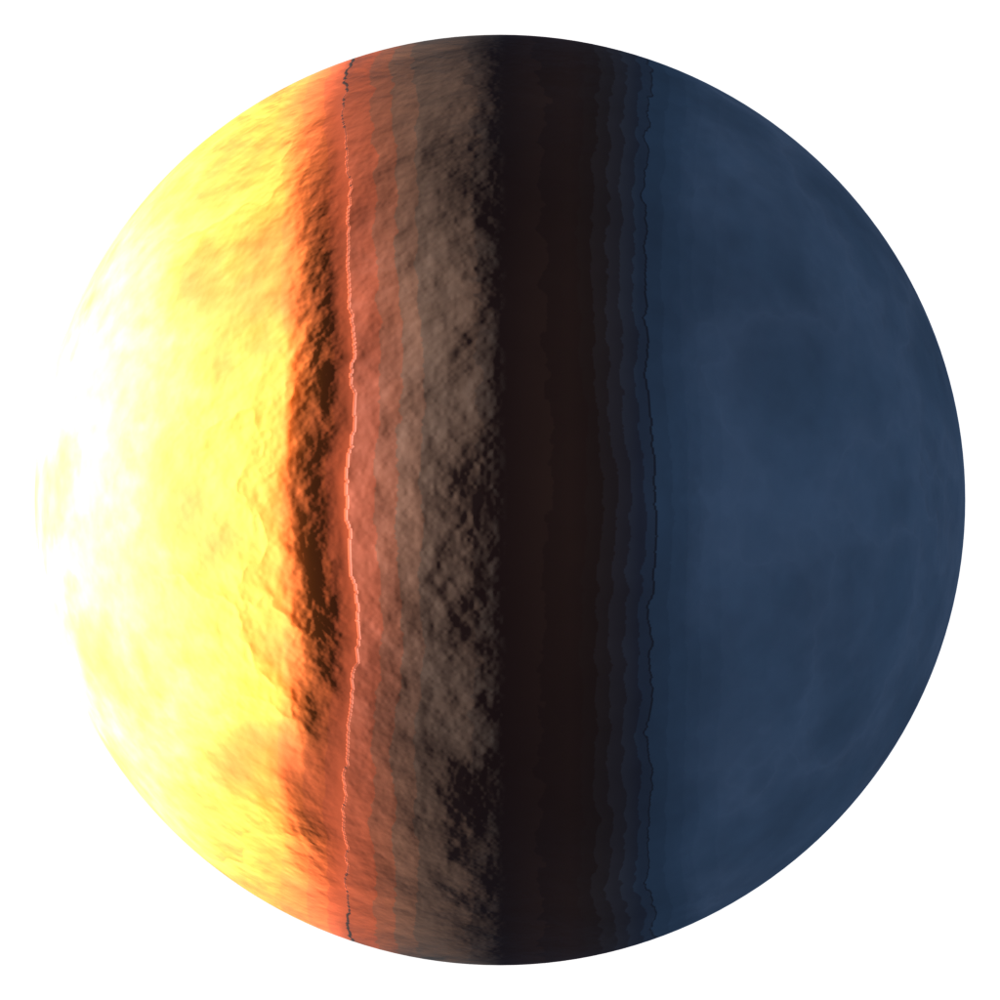
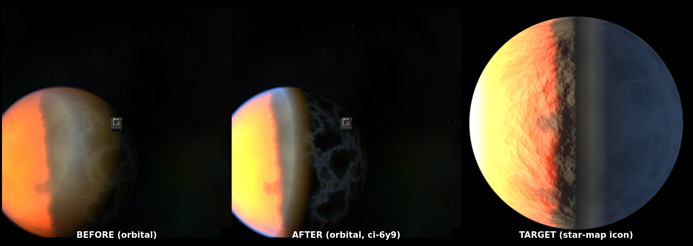
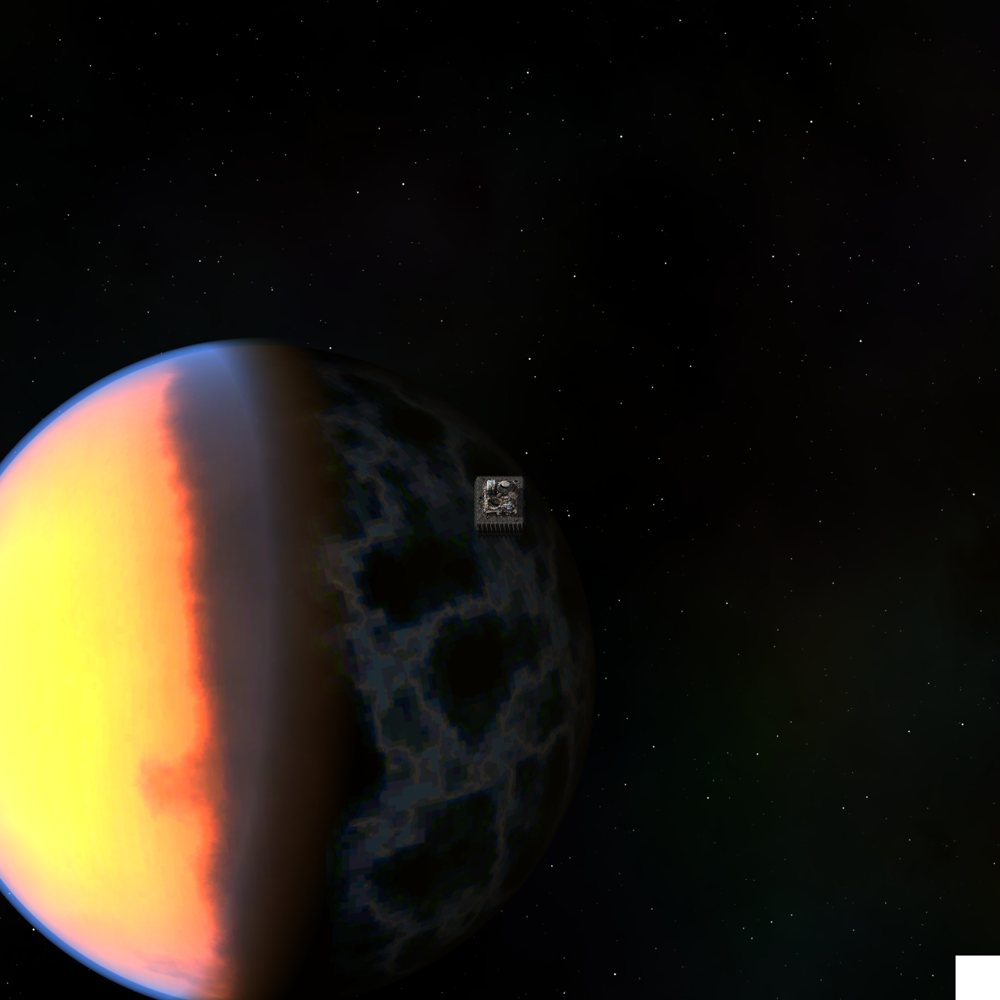
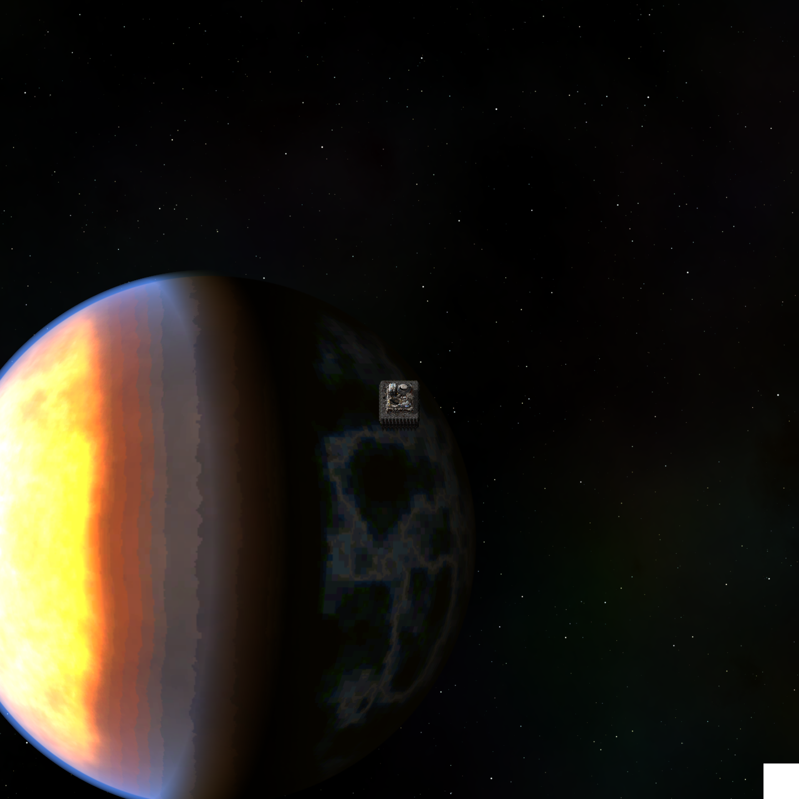
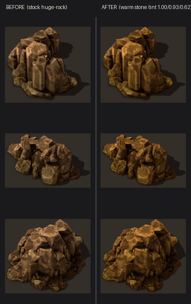
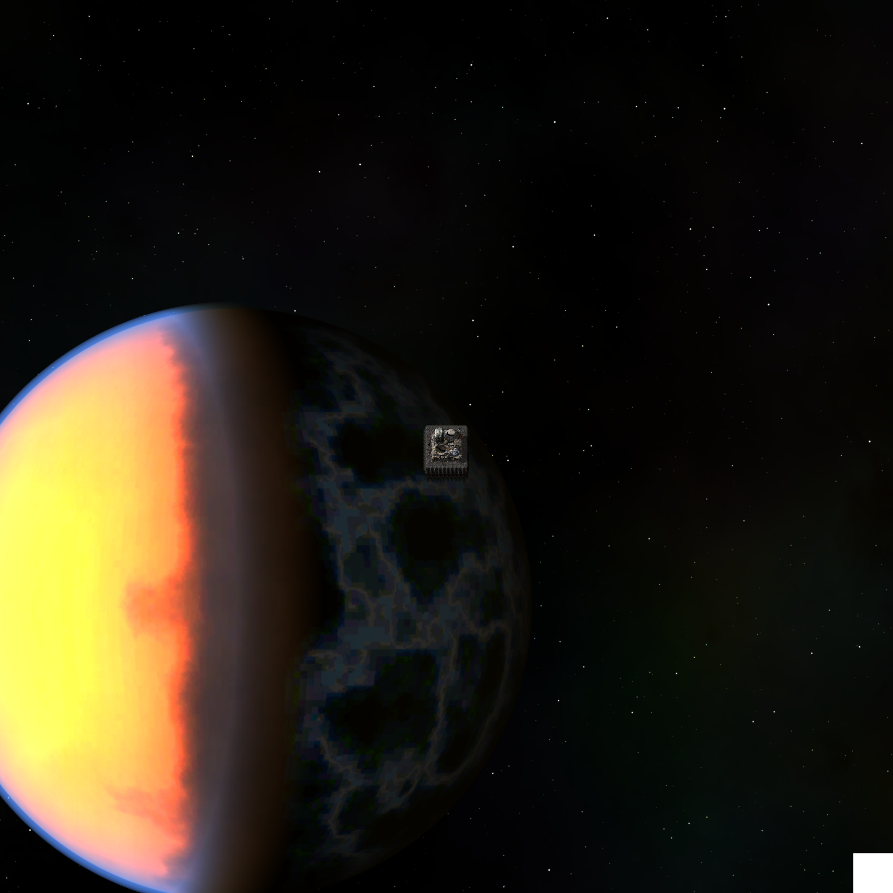
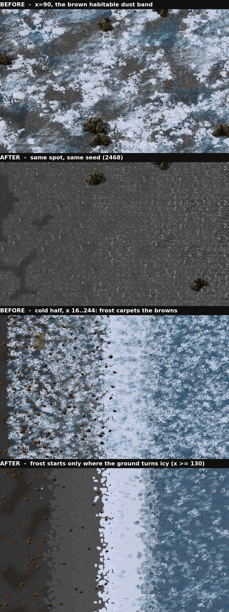

# Cindra planet art: verification



`cindra-static-globe.png` is the Blender/Cycles bake of the Cindra planet, produced
by `scripts/bake-starmap.py` from the procedural equirectangular maps in
`mods/cindra/graphics/space/`. It is the same render that becomes the star-map
sprite (`mods/cindra/graphics/icons/starmap-planet-cindra.png`), shown here at
full 1024x1024 for inspection.

## What it verifies

- **Tidally locked, one face presented.** The molten **dayside** (left, white-hot
  at the sub-stellar limb, cooling to magma orange), a dark **terminator** seam
  down the centre, and the frozen **nightside** (right, blue ice). The fire/ice
  split is the whole planet identity (planet_design.md sections 1-4).
- **No rotation.** The star-map sprite is a static PNG, so it cannot spin. The
  live orbital backdrop is frozen the same way: `rotation_seconds` is set to an
  enormous value (`NO_ROTATION = 1e9`) in `prototypes/space-appearance.lua`, so
  the same face is presented permanently. Only the cloud (terminator steam band)
  and hero-flare layers animate, via `rotate_with_planet = false`.

## Why this bake and not an in-engine screenshot

The Cycles bake is the deterministic, machine-independent stand-in for the
star-map sprite: it is built from the exact same equirectangular maps the engine
samples, so it reads as the same planet and renders identically anywhere.

**Update (ci-6y9): the live orbital backdrop CAN now be captured headless.** The
old claim here was that Factorio's expansion-shaders pass is disabled on headless
/ 0-VRAM machines so an in-engine capture "cannot show the globe at all." That is
no longer true: the full client runs under `Xvfb` with software GL via **EGL +
llvmpipe** (the ci-036 / ci-ijk incantation, `SDL_VIDEO_FORCE_EGL=1`), which gets
a real GL context without a working GLX. `scripts/render-orbit.sh` uses that path
to drive `scenarios/orbit-shot` (a platform spawned in orbit of Cindra, then
`game.take_screenshot` of its surface) and produce the real orbital screenshots
below. The bake is still the canonical star-map sprite; the live backdrop is now
tunable against an actual engine render instead of blind.

To regenerate everything (maps, bake, sprite, icon):

```bash
scripts/render-planet.sh
```

---

# In-game orbital parity with the star-map icon (ci-6y9)



`ci-6y9-orbital-parity.png` is the before/after for tuning the LIVE orbital
backdrop (`platform_surface_render_parameters.platform_backdrop`, wired in
`prototypes/space-appearance.lua`) to read like the baked star-map icon. All
three panels are real, unedited renders:

- **BEFORE** and **AFTER** are ACTUAL in-engine orbital screenshots (headless
  Factorio under Xvfb + EGL/llvmpipe, `scripts/render-orbit.sh`) of a space
  platform in orbit of Cindra. The small chip near the centre is the platform's
  starter hub.
- **TARGET** is the baked star-map icon (`starmap-planet-cindra.png`), untouched
  by this bead.

## What it verifies

- **Single sun from the LEFT, blown-out molten limb.** The engine light was
  aimed near-HORIZONTAL from the left (matching the bake's perpendicular sun) and
  the emission scalar cranked so the sunward limb clips to near-WHITE like the
  icon's hot highlight, falling off through orange/red toward the terminator.
- **Deep-blue ICE nightside, not a warm void.** Before, the shadowed hemisphere
  read dark olive/brown. The engine has no cool world-ambient field like the
  Blender bake's, so the emission map's blue ice-side self-glow (kept
  independent of shadow) is scaled up to stand in for it, and the atmosphere rim
  turned cool blue: the ice now reads as the icon's deep blue.
- **Soft ~half-lit terminator, clean seam.** The heavy grey steam band was
  thinned and the grazing specular sheen dropped so the sandy transition strip
  no longer reads as a bright cream wall but as the icon's darker rocky
  terminator.

The tuned values are guarded off-game and under the real runtime
(`unit-tests/test_space_appearance.lua`, `tests/test_space_appearance.lua`:
"orbital parity"). To reproduce the screenshots:

```bash
scripts/render-orbit.sh   # writes orbit-close.png / orbit-wide.png to .orbit-render/script-output/
```

---

# Dark volcanic mountains at the terminator (ci-6i1)



`ci-6i1-terminator-orbital.png` is a real, unedited in-engine orbital screenshot
(headless Factorio under Xvfb + EGL/llvmpipe, `scripts/render-orbit.sh`) of a
space platform in orbit of Cindra, captured after the recolour. The human had
flagged an ugly wide GRAY/TAN vertical stripe wedged between the volcanic side and
the ice side of the star-map globe.

## What it verifies

- **The gray/tan band is GONE.** The two middle `TERRAIN_STOPS` in
  `scripts/gen-planet-maps.py` (a sandy building-neutral `(0.62,0.56,0.42)` + a
  cool grey dust `(0.60,0.64,0.64)`) painted that stripe into the albedo. They are
  replaced by a BROAD band of DARK VOLCANIC MOUNTAINS (reddish-brown / near-black
  basalt: `#5A3524`, `#3E2A20`, `#4A3A30`) filling the middle third.
- **Reads molten -> dark mountains -> ice.** The disc now shows the glowing lava
  hemisphere, a dark basalt mountain belt at the terminator, then the frozen
  nightside, with no gray/tan blur anywhere between.
- **Ramps stay consistent.** `scripts/terrain.lua` `COLOR_STOPS` (the in-game
  map-view danger gradient) is updated in lockstep so the from-space art and the
  map view agree. The albedo maps are verified off-game by
  `unit-tests/test_planet_maps.py` (the terminator now asserts DARK, WARM basalt:
  low luminance, R>G>B, R clearly above B, not a neutral gray).
  *(Keeping the two ramps in lockstep BY HAND is exactly what failed next -- see
  "The globe is painted with the ground (ci-4qyj)" below, which removed the second
  copy altogether.)*

To regenerate the maps + bake and the orbital screenshot:

```bash
scripts/render-planet.sh   # maps, bake, star-map sprite, icon, thumbnail
scripts/render-orbit.sh    # live orbital screenshots -> .orbit-render/script-output/
```

---

# The globe is painted with the ground (ci-4qyj)



`ci-4qyj-orbital-three-part.png` is a real, unedited in-engine orbital screenshot
(headless Factorio under Xvfb + EGL/llvmpipe, `scripts/render-orbit.sh`) taken
after the from-space art was rebuilt on top of the ci-wly / ci-oe83 three-part
heightmap terrain.

## The problem it fixes

The space art and the ground each carried their own hand-copied colour ramp, and
they DRIFTED: `ci-oe83` rebuilt the terrain (and moved `terrain.lua`'s
`COLOR_STOPS`) while `gen-planet-maps.py` kept the older `ci-6i1` stops. The
planet you orbited was not the planet you landed on -- `PLAYTEST.md` even carried
a standing note telling testers to ignore the mismatch.

## What it verifies

- **Three parts, at the terrain's real widths.** A broad molten **lava ocean**
  (~26% of the ribbon axis, so a genuine sheet rather than a rim at the limb), the
  dark warm-rock **habitable middle**, and a broad **ice ocean** on the shadowed
  limb -- the same partition the map-gen paints, in the same proportions.
- **One palette, no second copy.** `scripts/terrain_ramp.py` READS
  `mods/cindra/scripts/terrain.lua` and replays its own
  position -> heat -> tile -> colour chain, so the art has no ramp of its own to
  drift. `unit-tests/test_terrain_ramp_lockstep.py` runs the real Lua module under
  `lua` and asserts the Python replay names the same tile and mixes the same
  colour at every sample across the axis (bit-exact, not within a tolerance).
- **The glow is the lethal ground.** Emission is gated on the heat field, so what
  radiates from orbit is exactly what burns underfoot; the habitable middle emits
  literally nothing and goes dark from the LIGHT, preserving the ci-i9m
  no-painted-seam contract. Asserted in `unit-tests/test_planet_maps.py`.
- **The star map shows all three.** `unit-tests/test_starmap_lighting.py` gained a
  molten -> rock -> ice read on the baked sprite, so a future re-bake cannot lose
  a region to the lighting.

The headline `cindra-static-globe.png` above is the matching re-bake.

---

# Bootstrap rock: stone tint (ci-jvc)



`ci-jvc-rock-stone-tint.png` is the before/after for the warm "vanilla stone"
tint laid over the finite bootstrap **rocks** (`cindra-rock`, a deep-copy of the
vanilla `huge-rock`). **Left:** the stock huge-rock art (cool brown-grey rubble).
**Right:** the same variations under the `{1.0, 0.93, 0.62}` multiply-tint wired
in `prototypes/resources.lua` (value + rationale: `scripts/rock_tint.lua`). Both
are composited over the dark volcanic-soil colour of the Cindra terminator so the
legibility read is honest.

## What it verifies

- **Reads as yellowish STONE, not generic rubble.** Red stays full, green is
  trimmed a little and blue a lot, which pulls the brown-grey toward a warm
  sandstone gold while keeping the crevice depth (stronger blue cuts tip over
  into a muddy olive). This is the look ci-jvc asked for.
- **Still legible against Cindra terrain.** The rocks pop against the dark warm
  terminator soil in both states; the tint does not wash them into the ground.

## Why a faithful multiply, not an in-engine screenshot

The engine renders a `Sprite.tint` as a per-pixel multiply into the source
texture, so this PIL multiply of the exact vanilla source PNGs is pixel-faithful
to what the game draws (and unlike an FBSR render, which does not honour sprite
tint, it actually shows the shift). The remaining "does it feel like stone in
motion, against live terrain and lighting" read is the one thing a still cannot
judge -- that is the PLAYTEST.md entry.

To regenerate:

```bash
# calibrated in the ci-jvc spike; see the bead for the tint-sweep sheets
nix-shell -p "python3.withPackages(ps: with ps; [numpy pillow])" \
  --run "python3 scripts/render-rock-tint.py"
```

## Orbital light-axis alignment: no wedge (ci-lcv)



`ci-lcv-orbital-light-axis.png` (+ `-wide`) is a real in-engine capture of the
LIVE orbital backdrop after the ci-lcv fix, from `scripts/render-orbit.sh`.

### What it verifies

The from-orbit globe carries TWO independent light axes: the **baked** fire->ice
gradient down the `lon=0` meridian (in `planet_surface` / `planet_emission`), and
the engine's **diffuse** light (`light_direction`). The playtest report saw them
CROSS at an angle -- a pie-slice **wedge** -- because a rolled `planet_axis`
(`{-18,-4}`) tilted the baked meridian off the vertical diffuse terminator. That
is the exact analogue of the bake's own ci-pde X-tilt wedge (see
`scripts/bake-starmap.py`).

Fix (in `prototypes/space-appearance.lua`): un-roll `planet_axis` to `{0,0}` so
the baked meridian is vertical, and zero the vertical (y) component of
`light_direction` so the diffuse terminator is vertical too. With both vertical
they COINCIDE, so the disc reads as one clean molten-left / ice-right split with a
single terminator -- no wedge. Guarded off-game and under the runtime
(`unit-tests/test_space_appearance.lua`, `tests/test_space_appearance.lua`:
"aligns the two light axes").

To regenerate:

```bash
scripts/render-orbit.sh   # -> .orbit-render/script-output/orbit-{close,wide}.png
```

## Cold-side decal density: the ground reads through the frost (ci-tizx)



`ci-tizx-cold-decal-density.png` is a real in-engine before/after capture of the
LIVE Cindra ground, from `scripts/render-mapgen.sh` (same Xvfb + EGL/llvmpipe path
as the orbital renders, driving `scenarios/mapgen-shot`). Both halves are the same
fixed seed (2468) and the same camera positions; only the decal/scatter tuning
differs.

### What it verifies

The playtest report was that the snow/ice decals were so thick you could barely
see the terrain tiles, and that they bled deep into the brown habitable band. Both
are visible in the BEFORE frames: at x = 90 -- squarely in the brown dust band --
the ground is a near-solid sheet of snow and ice decals, and the wide shot shows
that carpet running from the safe band all the way to the ice.

The cause was a boundary mismatch. The cold decals were gated at the ribbon's SAFE
band (perp -24), but the habitable BROWNS (ash, then dust) run out to the icy edge
at perp -130 -- so ~100 tiles of brown ground sat inside the "icy" decal zone. The
fix (`scripts/decorative-field.lua`) reads the terrain's own brown->snow boundary
(`terrain.damage_bounds().cold_from`) as the decal gate, fades the frost in over 40
tiles from there, and scales each cold decal by a density multiplier (the huge
snow-drift art the sparsest). The ice-rock chunk scatter that shares the same band
was halved. Measured on the fixed test seed: 0.182 -> 0.059 decals per tile.

In the AFTER frames the dust band is bare ground with the odd ice-rock, the frost
thickens gradually across the snow tiles, and the deep ice still reads frozen with
the TILES, not the decals, doing the work.

Guarded by `unit-tests/test_decorative_field.lua` (the gate tracks the terrain
boundary, the fade ramps, every cold decal is thinned) and on a live surface by
`tests/test_decoratives.lua` + `tests/test_worldgen.lua` (density ceilings that
fail at the old values).

To regenerate:

```bash
scripts/render-mapgen.sh  # -> .mapgen-render/script-output/mapgen-*.png
```
